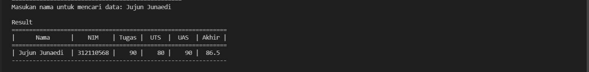

# Program Data Mahasiswa
# Struktur Package & modul

* Didalam folder model terdapat 1 file daftar nilai.
* berikut adalah isi file nya :
```
from view.input_nilai import *

data = {}

# Menambahkan data
def tambah_data():
    global data
    ulangi = 'y'
    while ulangi =='y':
        nama = input_nama()
        nim = input_nim()
        nilai_tugas = input_tugas()
        nilai_uts = input_uts()
        nilai_uas = input_uas()
        nilai_akhir = akhir()
        data[nama] = [nama, nim, nilai_tugas, nilai_uts, nilai_uas, nilai_akhir]
        ulangi = (input('tambah data?(y/t) : '))

        if ulangi == 't':
            print('\nData berhasil di tambah!')
            return data

# Mengubah data
def ubah_data():
    nama = input("Masukan nama untuk mengubah data: ")
    if nama in data.keys():
        print("\nMau mengubah apa?")
        sub_data = input("(Semua), (NIM), (Tugas), (UTS), (UAS) : ")
        if sub_data.lower() == "semua":
            print("==========================")
            print("Ubah data {}.".format(nama))
            print("==========================")
            data[nama][1] = input("Ubah NIM:")
            data[nama][2] = int(input("Ubah Nilai Tugas: "))
            data[nama][3] = int(input("Ubah Nilai UTS: "))
            data[nama][4] = int(input("Ubah Nilai UAS: "))
            data[nama][5] = data[nama][2] *30/100 + data[nama][3]*35/100 + data[nama][4] *35/100
            print("\nBerhasil ubah data!")

        elif sub_data.lower() == "nim":
            data[nama][1] = input("\nNIM:")
            print('\nData berhasil di ubah!')
        elif sub_data.lower() == "tugas":
            data[nama][2] = int(input("\nNilai Tugas: "))
            data[nama][5] = data[nama][2] *30/100 + data[nama][3]*35/100 + data[nama][4] *35/100
            print('\nData berhasil di ubah!')
        elif sub_data.lower() == "uts":
            data[nama][3] = int(input("\nNilai UTS: "))
            data[nama][5] = data[nama][2] *30/100 + data[nama][3]*35/100 + data[nama][4] *35/100
            print('\nData berhasil di ubah!')
        elif sub_data.lower() == "uas":
            data[nama][4] = int(input("\nNilai UAS: "))
            data[nama][5] = data[nama][2] *30/100 + data[nama][3]*35/100 + data[nama][4] *35/100
            print('\nData berhasil di ubah!')
        else:
            print("\nMenu tidak ditemukan.")

    else:
        print("'{}' Tidak ditemukan.".format(nama))

# Menghapus data
def hapus_data():
    nama = input("Masukan nama untuk menghapus data : ")
    if nama in data.keys():
        del data[nama]
        print("\nData '{}' berhasil dihapus.".format(nama))
    else:
        print("'{}' Tidak ditemukan.".format(nama))

# Mencari data
def cari_data():
    print("Mencari data: ")
    print("=================================================")
    nama = input("Masukan nama untuk mencari data: ")
    print('\nResult')
    print("==============================================================")
    print("|      Nama      |    NIM    | Tugas |  UTS  |  UAS  | Akhir |")
    print("==============================================================")
    if nama in data.keys():
        print("| {0:14} | {1:9} | {2:5} | {3:5} | {4:5} | {5:5}"
            .format(nama, data[nama][1], data[nama][2], data[nama][3], data[nama][4], data[nama][5]))
        print('--------------------------------------------------------------')
    else:
        print("'{}' Tidak ditemukan.".format(nama))
```
* Didalam folder view terdapat file input_nilai.py dan view_nilai.py
* berikut adalah isi file nya :
```
def input_nama():
    print("Masukan Data Mahasiswa")
    global nama
    nama = input("Nama: ")
    return nama

def input_nim():
    global nim
    nim = input("Nim: ")
    return nim

def input_tugas():
    global nilai_tugas
    nilai_tugas = int(input("Masukan nilai tugas: "))
    return nilai_tugas

def input_uts():
    global nilai_uts
    nilai_uts = int(input("Masukan nilai uts: "))
    return nilai_uts

def input_uas():
    global nilai_uas
    nilai_uas = int(input("Masukan nilai uas: "))
    return nilai_uas

def akhir():
    global nilai_akhir
    nilai_akhir = (nilai_tugas)*30/100 + (nilai_uts)*35/100 + (nilai_uas)*35/100
    return nilai_akhir

```
* Isi file view.py :
```
from model.daftar_nilai import data

def lihat_data():
    print("Daftar Nilai:")
    print("===================================================================")
    print("| No |      Nama      |    NIM    | Tugas |  UTS  |  UAS  | Akhir |")
    print("===================================================================")
    if data.keys():
        no = 1
        for tabel in data.values():
            print("| {0:2} | {1:14} | {2:9} | {3:5} | {4:5} | {5:5} | {6:5} |".format
                (no, tabel[0], tabel[1], tabel[2], tabel[3], tabel[4], tabel[5]))
            print('-------------------------------------------------------------------')
            no += 1
    else:
        print("=========================TIDAK ADA DATA============================")
        print("===================================================================")
```
* setelah membuat packpage dan function, saya membuat file utamanya untuk memanggil function yang di buat tadi :
```
from model.daftar_nilai import *
from view.view_nilai import *

print("===============================================================")
print("|                PROGRAM INPUT NILAI MAHASISWA                |")
print("===============================================================")

while True:
    print("\n")
    menu = input("1 = tambah \n2 = lihat \n3 = Hapus \n4 = cari \n5 = ubah \n6 = keluar\nPilih Menu: ")
    print ("\n")

    if menu == "1" :
        tambah_data()
    elif menu == "2" :
        lihat_data()
    elif menu == "3" :
        hapus_data()
    elif menu == "4" :
        cari_data()
    elif menu == "5" :
        ubah_data()
    elif menu == "6" :
        break
    else:
        print("Input yang anda masukan salah coba ulangi")
```
# Output program :
1. Menambahkan data

2. Melihat data

3. Menghapus data

4. Mengubah data

5. Mencari data

6. Keluar, jika menginput keluar maka loopingnya berhenti
